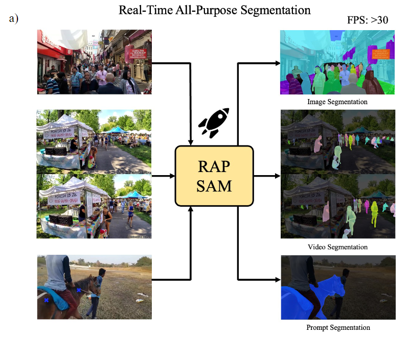
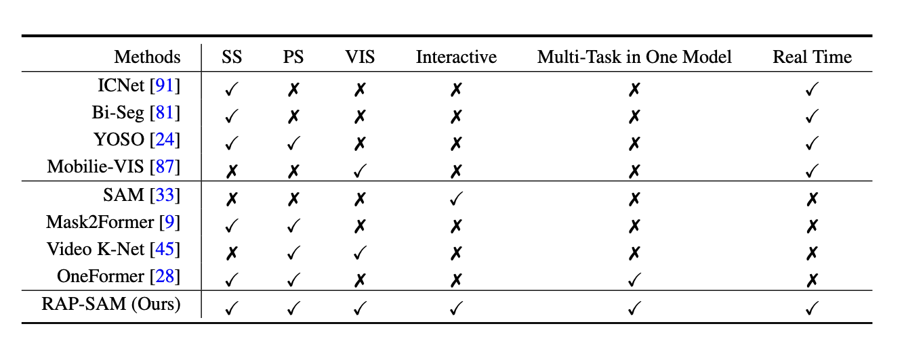
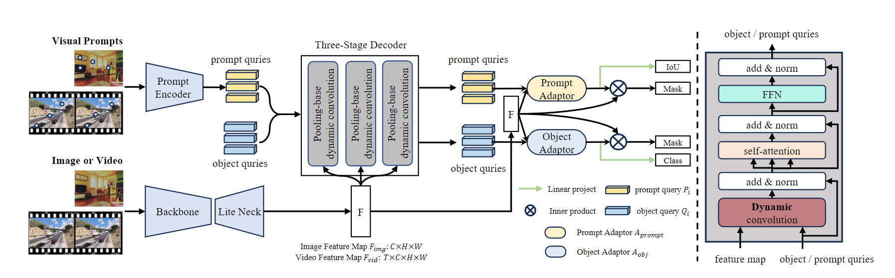
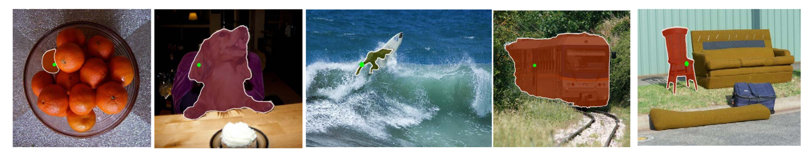
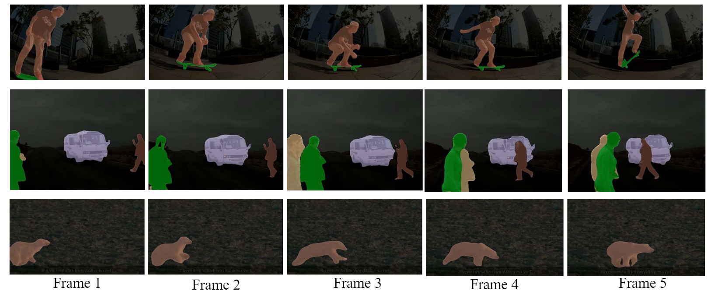
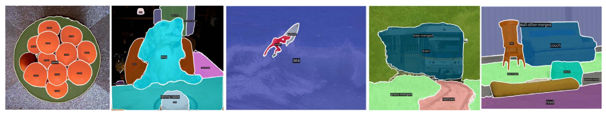

<br />
<p align="center">
  <h1 align="center">RAP-SAM: Towards Real-Time All-Purpose Segment Anything</h1>
  <p align="center">
    <a href="https://scholar.google.com/citations?user=8bBcL9sAAAAJ&hl=en"><strong>Shilin Xu</strong></a>
    ·
    <a href="https://yuanhaobo.me/"><strong>Haobo Yuan</strong></a>
    ·
    <a href="https://qingyushi.github.io"><strong>Qingyu Shi</strong></a>
    ·
    <a href="http://luqi.info/"><strong>Lu Qi</strong></a>
    ·
    <a href="https://scholar.google.co.uk/citations?user=GStTsxAAAAAJ&hl=zh-CN"><strong>Jingbo Wang</strong></a>
    ·
    <a href="https://scholar.google.com/citations?user=DxXXnCcAAAAJ&hl=zh-CN"><strong>Yibo Yang</strong></a>
    ·
    <a href="https://scholar.google.com.hk/citations?user=y_cp1sUAAAAJ&hl=en"><strong>Yining Li</strong></a>
    ·
    <a href="https://chenkai.site/"><strong>Kai Chen</strong></a>
    ·
    <a href="https://scholar.google.com/citations?user=T4gqdPkAAAAJ&hl=zh-CN"><strong>Yunhai Tong</strong></a>
    ·
    <a href="https://scholar.google.com/citations?hl=zh-CN&user=rVsGTeEAAAAJ"><strong>Bernard Ghanem</strong></a>
    ·
    <a href="https://lxtgh.github.io/"><strong>Xiangtai Li</strong></a>
    ·
    <a href="https://scholar.google.com/citations?user=p9-ohHsAAAAJ&hl=zh-CN"><strong>Ming-Hsuan Yang</strong></a>
  <br >
     PKU, NTU, UC-Merced, Shanghai AI, KAUST, Google Research
  </p>

  <p align="center">
    <a href='https://arxiv.org/abs/2401.10228'>
       </a>
    <a href='https://xushilin1.github.io/rap_sam/' style='padding-left: 0.5rem;'>
       </a>
    <a href='https://huggingface.co/spaces/shilinxu/rap-sam' style='padding-left: 0.5rem;'>
       </a>
  </p>

<br/>

## Introduction



We present real-time all-purpose segmentation to segment and recognize objects for image, video, and interactive inputs. In addition to benchmarking, we also propose a simple yet
effective baseline, named RAP-SAM, which achieves the best accuracy and speed trade-off among three different tasks.



## Method


Our RAP-SAM is a simple encoder and decoder architecture. It contains a backbone, a lightweight neck, and a shared multitask decoder.  Following SAM, we also adopt the prompt encoder to encode visual prompts into a query. We adopt the same decoder for both visual prompts and initial object queries to share more computation and parameters. To better balance the results for in-teractive segmentation and image/video segmentation, we design a prompt adapter and an object adapter in the end of the decoder.

## Requirements
The detection framework is built upon [MMDet3.0](https://github.com/open-mmlab/mmdetection).

Install the packages:
```bash
pip install mmengine==0.8.4
pip install mmdet==3.3.0
```
Generate classifier using the following command or download from [CocoPanopticOVDataset_YouTubeVISDataset_2019.pth](https://1drv.ms/u/c/12a1b84edebf20f7/EXxePOUe_jpJsAC2FqVaPzkBv0X1y0cIkmwlp4wE7bkW5A?e=a3GMnj) and [CocoPanopticOVDataset.pth](https://1drv.ms/u/c/12a1b84edebf20f7/EVjJu546FCtAko-aqlsb11IB2vYAMyXHd3cTe5OdsLllRA?e=gV6qat) .
```
PYTHONPATH='.' python tools/gen_cls.py configs/rap_sam/rap_sam_convl_12e_adaptor.py
```
## Data Preparation
The main experiments are conducted on [COCO](https://cocodataset.org/#home) 
and [YouTube-VIS-2019](https://youtube-vos.org/dataset/vis/) datasets. 
Please prepare datasets and organize them like the 
following:

```text
├── data
    ├── coco
        ├── annotations
            ├── instances_val2017.json
        ├── train2017
        ├── val2017
    ├── youtube_vis_2019
        ├── annotations
            ├── youtube_vis_2019_train.json
            ├── youtube_vis_2019_valid.json
        ├── train    
        ├── valid      
```
## Run Demo
```
python demo/demo.py demo/demo.jpg configs/rap_sam/eval_rap_sam_coco.py --weights rapsam_r50_12e.pth
```
## Inference
We provide the checkpoint here. You can download them and then run the command below for inference.

[rapsam_r50_12e.pth](https://1drv.ms/u/c/12a1b84edebf20f7/EZn9BJ9lv6FKieTMXTqLh28BjWgTVbG3sJOltfH7rEF2xg?e=g3dqiu)

#### Test on COCO Panoptic 

```base 
./tools/dist_test.sh configs/rap_sam/eval_rap_sam_coco.py $CKPT $NUM_GPUS
```
#### Test on Video Instance Segmentation
```base 
./tools/dist_test.sh configs/rap_sam/eval_rap_sam_yt19.py $CKPT $NUM_GPUS
```


#### Test on Interactive Segmentation (COCO-SAM)
```base 
./tools/dist_test.sh configs/rap_sam/eval_rap_sam_prompt.py $CKPT $NUM_GPUS
```


## Training 

The code will be release soon!!! Please stay tuned.


## Visualization
### Interactive Segmentation


### VIS Segmentation


### COCO Panoptic Segmentation



## Citation
```
@article{xu2024rapsam,
    title={RAP-SAM: Towards Real-Time All-Purpose Segment Anything},
    author={Shilin Xu and Haobo Yuan and Qingyu Shi and Lu Qi and Jingbo Wang and Yibo Yang and Yining Li and Kai Chen and Yunhai Tong and Bernard Ghanem and Xiangtai Li and Ming-Hsuan Yang},
    journal={arXiv preprint},
    year={2024}
}
```
## License
MIT license 
